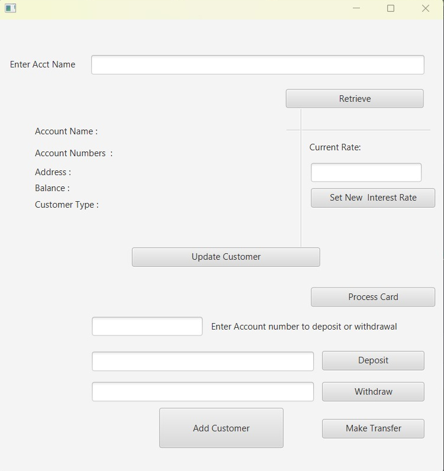

# JavaFX Bank Management System




This JavaFX application implements a simple banking system with support for different account types such as Savings, Current, ISA, and Reward accounts. The application follows the Model-View-Controller (MVC) architecture for clean code organization.


## Project Structure

```
.
src
├── main
│   ├── java
│   │   └── com
│   │       └── example
│   │           └── cm2115
│   │               ├── model
│   │               │   ├── CSVHandler.java
│   │               │   ├── Customer.java
│   │               │   ├── Account.java
│   │               │   ├── BankAccount.java
│   │               │   ├── ISA.java
│   │               │   ├── BasicAccount.java
│   │               │   ├── RewardAccount.java
│   │               │   ├── CurrentAccount.java
│   │               │   ├── SavingsAccount.java
│   │               │   └── RewardAccount.java
│   │               ├── view
│   │               │   ├── AddCustomer.fxml
│   │               │   ├── AccountManager.fxml
│   │               │   ├── Customer.fxml
│   │               │   └── card.fxml
│   │               ├── controller
│   │               │   ├── AddCustomerController.java
│   │               │   ├── AccountManagerController.java
│   │               │   ├── CustomerController.java
│   │               │   └── cardcontroller.java
│   │               └── Main.java
│   └── resources
│       └── com
│           └── example
│               └── cm2115
│                   ├── customer.csv
│                   ├── account.csv
│                   └── rate.csv
```


## Key Features

### Model-View-Controller (MVC) Architecture:

- The project is structured based on the MVC design pattern, promoting a clear separation of concerns and enhancing code modularity.

### Model Layer (`com.example.cm2115`):

- The `customer` class encapsulates customer-related data and behavior.
- The `CSVHandler` class handles CSV file reading and writing operations.

### View Layer (JavaFX FXML):

- FXML files define the user interface components and layout for different scenes.

### Controller Layer:

- Controllers (`AccountManagerController`, `AddCustomerController`, `CustomerController`) handle user input, manage interactions between models and views, and update the UI accordingly.

### User Interactions:

- The application supports actions such as deposit, withdrawal, and checking interest rates for different account types.

### Data Persistence:

- Customer and account data is stored and retrieved using CSV files.

## Usage

### Account Management

1. **View Customer Accounts:**
   - Navigate to the Account Manager scene.
   - Explore and manage customer accounts.

2. **Add a New Customer:**
   - Go to the Add Customer scene.
   - Fill in the required details, such as account name, address, and account type.
   - Click "Register" to create a new customer.

### Customer Interaction

1. **Search for Customer Accounts:**
   - Use the provided search functionality to find customer accounts by account name.

2. **View and Update Customer Details:**
   - Access the Customer scene.
   - View customer details, including account name, address, customer type, and account numbers.
   - Update customer information, such as name, address, and customer type.

3. **Financial Operations:**
   - Perform financial operations, including deposits and withdrawals.
   - Check interest rates for specific account types.


### Data Persistence

- Customer and account data is persisted using CSV files. Any changes made during the session will be stored for future use.


## Class Documentation

### 1. Main Class

**Main.java:** Entry point of the application responsible for launching the JavaFX interface.

### 2. Customer Class

**customer.java:** Model class representing customer details, including name, address, and customer type.

### 3. CSVHandler Class

**CSVHandler.java:** Utility class for reading and writing CSV files. It provides methods for reading data from CSV, writing data to CSV, and appending data to an existing CSV file.

### 4. AccountManagerController Class

**AccountManagerController.java:** Controller class managing customer accounts. It handles deposit, withdrawal, and displays customer information.

### 5. AddCustomerController Class

**AddCustomerController.java:** Controller class for adding new customers. It generates random customer and account IDs, writes data to CSV files, and updates the Account Manager view.

**Note:** Ensure to replace the file paths in the `CSVHandler` calls with appropriate paths in your application.

Feel free to explore and enhance the application based on your specific requirements. If you have any questions or need further assistance, don't hesitate to reach out. Happy coding!


## How to Run

### Prerequisites

Make sure you have [Maven](https://maven.apache.org/) installed on your system.

### Compilation

To compile the project, navigate to the project root directory and run the following command:

```bash
$ mvn compile
```

### Run the Application
After compilation, you can run the application using the following command:

```bash
$ mvn javafx:run
```


### 6. Contributing
Feel free to contribute to the project by opening issues or creating pull requests. Your feedback and suggestions are highly appreciated!

### 7. License
This project is licensed under the MIT License - see the [LICENSE](LICENSE.txt) file for details.
